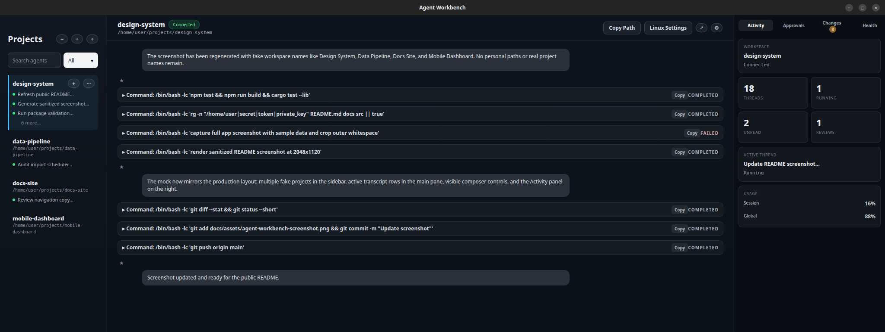

# Agent Workbench

Agent Workbench is a Linux desktop app for managing local Codex workspaces and long-running agent sessions. It gives each project its own workspace, restores local thread history, streams app-server events into a desktop conversation view, and keeps workspace defaults close at hand.

This project currently targets Ubuntu and other Debian-based Linux desktops. Release builds are packaged as `.deb` files.



## What It Does

- Adds local project folders as persistent workspaces.
- Starts one `codex app-server` process per connected workspace.
- Restores local thread history and resumes threads from the selected workspace.
- Sends prompts, streams reasoning/tool output, and handles approval requests.
- Supports per-workspace defaults and per-thread overrides for model, reasoning effort, speed mode, access mode, and custom Codex binary path.
- Provides sidebar search, rename, pin, archive, reconnect, and refresh controls.
- Includes review presets, checkpoints, a resizable sidebar, debug logging controls, and release checksum tooling.

## Requirements

- Ubuntu or a compatible Debian-based Linux desktop.
- Node.js and npm.
- Rust stable toolchain.
- A local Codex CLI that supports `codex app-server`.
- Tauri/WebKitGTK desktop dependencies.

Typical Ubuntu dependency set:

```bash
sudo apt install libwebkit2gtk-4.1-dev libgtk-3-dev libsoup-3.0-dev \
  libayatana-appindicator3-dev librsvg2-dev patchelf
```

By default, Agent Workbench looks for `codex` in `PATH`. If needed, set an absolute custom binary path per workspace from Linux Settings inside the app.

## Run From Source

Install dependencies:

```bash
npm install
```

Run the desktop app in development mode:

```bash
npm run tauri dev
```

Preview the static UI shell in a browser:

```bash
npm run dev
```

The browser preview is only for layout checks and screenshots. Workspace connections, folder picking, app-server sessions, and desktop integrations require the Tauri runtime.

## Build A Debian Package

Build the app:

```bash
npm run build:deb
```

Write SHA-256 checksums beside the generated package:

```bash
npm run release:checksums
```

The package is written under:

```text
src-tauri/target/release/bundle/deb/
```

## Verification

Useful checks before sharing a build:

```bash
npm test
npm run build
npm audit --audit-level=moderate
npm run smoke:app-server
cd src-tauri
cargo test --lib
cargo clippy --lib -- -D warnings
cargo audit --quiet
```

`cargo audit --quiet` currently exits successfully but reports warning advisories in transitive Tauri/GTK dependencies. The current review notes are tracked in [docs/SECURITY-REVIEW.md](docs/SECURITY-REVIEW.md).

## Security Notes

Agent Workbench is a local desktop shell around a configured `codex app-server` process. It can act on local project files through that process, so review approval prompts carefully and only use trusted binaries.

- Workspace paths and custom binary paths are stored locally in the app data directory.
- Custom binaries must be absolute executable files.
- Debug and health diagnostics are redacted on a best-effort basis before display or copy.
- Approval prompts remain enabled even when a workspace uses full-access mode.
- Release artifacts are checksummed with SHA-256, but not signed yet.

Please report security-sensitive issues privately if possible. See [SECURITY.md](SECURITY.md).

## Runtime Notes

- Workspaces persist to `workspaces.json` under the app data directory.
- Threads are restored by filtering `thread/list` results by workspace `cwd`.
- Selecting a thread calls `thread/resume` to refresh messages from disk.
- CLI sessions appear if their `cwd` matches the workspace path; they are not live-streamed unless resumed.
- Each workspace launches its own app-server process with that workspace as the child process working directory.
- Last active workspace and thread restore on relaunch.
- Per-thread overrides and checkpoints persist in local storage.
- Release builds currently produce Debian packages only.

## Troubleshooting

**Workspace not connected**

Reconnect the workspace from the sidebar or Linux Settings. The app marks workspaces disconnected when the underlying app-server session exits.

**Custom binary fails to save**

Custom binaries must be absolute executable file paths. Leave the field blank to use `codex` from `PATH`.

**Custom binary saves but reconnect fails**

Confirm the selected file launches the expected app-server command. The workspace settings panel shows validation failures inline, and the main UI shows reconnect errors.

**Threads do not appear after adding a workspace**

Confirm the workspace connected successfully and that local thread history exists in that folder. Use the workspace refresh action to reload `thread/list`.

**Approval requests are missing**

Approval prompts only appear when the app-server emits a request. If a turn stalls, open the debug panel and inspect the latest stderr/error events.

**The package installs but the app does not launch**

Verify the target machine has the required WebKitGTK and GTK dependencies listed above before installing the `.deb`.

## Project Docs

- [Security review](docs/SECURITY-REVIEW.md)
- [Smoke test checklist](docs/SMOKE-TEST-CHECKLIST.md)

## License

MIT. See [LICENSE](LICENSE).
